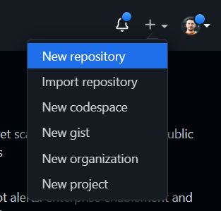

[Voltar](/README.md)

# Cronograma do Workshop

## Criando um repositório no GitHub

No GitHub, a partir do menu superior direito, clicar no sinal de “+”, depois em **“New Repository”**

Na tela de repositório, dar ao repositório o mesmo nome do seu perfil no GitHub e marcar  **“Add a README file”**:

No repositório, clicar no botão “<> Code”, depois na aba “Local”, depois “HTTPS” e copiar o endereço:

## Clonando o repositório localmente

Abrir o terminal do Windows (Windows + R, “cmd”), digitar “git” para se certificar que o git está instalado na máquina. Deve aparecer algo como a imagem abaixo:

No terminal, navegar até a pasta `c:\` com o comando `cd c:\`:

Neste local, criar uma pasta chamada `repos` com o comando `mkdir repos` e entrar nesta pasta com `cd repos`

Nesta pasta, escrever `git clone` concatenando o endereço do repositório do GitHub copiado anteriormente. Algo semelhante a imagem abaixo será mostrado:

Navegue até o repositório recém baixado com o comando `cd <nome_do_repositório>`a,no caso so exemplo `cd abc123`:

## Utilizando o VS Code para editar o arquivo Readme.md

Se o VS Code estiver instalado na máquina, digite `code .` e pressione Enter. O VS Code deve abrir a pasta(repositório) atual. Caso uma mensagem seja exibida sobre confiar nos autores da pasta, confirme:

Abrir o arquivo `README.md` a partir da barra lateral:

Entrar no seguinte endereço do GitHub Gists: [https://gist.github.com/thcerutti/540fd54b51307062366665e2c51a8038](https://gist.github.com/thcerutti/540fd54b51307062366665e2c51a8038)

Clicar no botão “Raw” copiar todo o texto:

Colar no arquivo `README.md` que está aberto no VS Code e salvar:

Vamos fazer o commit primeiramente pelo terminal para aprender via linha de comando, sempre ficando de olho na aba de controle de versão (segundo ícone, lado esquerdo).

## Adicionando arquivos no `git`

Primeiramente precisamos falar pro git quais arquivos serão incluídos no nosso primeiro commit. No nosso caso vamos adicionar todos (no caso “todos” resume-se a 1 arquivo, o README.md). Para isso vamos executar o comando `git add --all`

## Mandando alterações para `git`

Depois disso o arquivo que aparecia como “Changes” agora aparece como “Staged Changes”. A área de staging é a nossa área intermediária que identifica o que queremos adicionar ao commit. Com nosso arquivo identificado, vamos criar nosso primeiro commit com o comando

`git commit -m "adiciona modelo de perfil"`

Perceba que nosso arquivo foi commitado localmente, o que significa que o GIT está monitorando as alterações que fizemos até o momento. Agora precisamos enviar para o GitHub e para isso precisamos informar o GIT que queremos fazer um push, ou seja, queremos “empurrar” o código para o GitHub, identificando a nossa branch local como sendo a branch main do GitHub. Para isso rodamos o comando

`git push -u origin main`

Mas quando fazemos isso o git fala que precisa autenticar no GitHub para enviarmos o código. Aqui selecionamos a opção de autenticar pelo browser, então podemos informar “’1” ou simplesmente dar um Enter para que ele assuma este método de autenticação:

Uma janela do navegador será aberta e se você já estiver logado no GitHub, a autenticação será automática e uma janela como a abaixo será mostrada:

De volta para o VS Code, o terminal mostra que o commit deu certo:

Agora já podemos verificar o nosso repositório no GitHub, que já deve ter o código atualizado:

## Trabalhando com branches

Agora vamos abrir uma branch nova para fazer algumas alterações no arquivo e treinar o fluxo de Pull Requests. No VS Code podemos ver que estamos na branch principal do projeto, chamada de “main”. Vamos criar uma branch a partir dela com o seguinte comando

`git checkout -b atualiza-perfil`

Perceba que no canto inferir esquerdo já aparece o nome da nossa nova branch

Vamos alterar o arquivo `README.md` com as nossas informações pessoais. Depois de alterarmos o arquivo, podemos ver o que foi alterado com o comando `git diff` no terminal, que deve gerar algo parecido com isso:

Para sair do modo de visualização de diferenças, pressionamos `q` (quit). Agora precisamos adicionar os arquivos alterados, mas agora faremos isso pela barra lateral, clicando no sinal de “+” ao lado do arquivo, mandando ele para a área de staging:

Escrevemos uma mensagem de commit, neste caso pode ser “Dados pessoais preenchidos”, e clicamos no botão “Commit”

## Mandando a branch pro GitHub e abrindo um Pull Request

Agora precisamos publicar a branch, clicando no botão “Publish Branch”. Pronto, as alterações agora já estão no GitHub separadas em uma branch separada. Quando visualizamos a página do projeto no GitHub nos é mostrada a seguinte mensagem:

As nossas alterações estão em uma “linha do tempo” paralela, e isso é útil para fazermos alterações e revisar essas informações antes de o código ir para “produção”. Vamos clicar no botão “Compare & pull request”. Aqui podemos escrever uma mensagem descrevendo o que fizemos, analisar as diferenças de código e criar o pull request para que alguém revise (fluxo real das empresas)

Ao clicar no botão “Create pull request” somos levados à página de pull requests, onde vamos revisar as alterações feitas, e se estiver tudo ok vamos clicar no botão “Merge pull request”

Caso esta informação seja mostrada, clique no botão “Confirm Merge”

Pronto! Agora que o Pull Request (PR) foi mergeado (mesclado) com a branch principal (main), já podemos apagar esta branch na qual fizemos as alterações (não obrigatório), clicando no botão “delete branch”

Agora no VS Code, vamos alternar para a branch principal (main) e baixar as alterações que acabamos de fazer com o comando

`git checkout main` para retornarmos para nossa branch principal

`git pull` para baixarmos as últimas alterações

Pronto! Agora a sua branch principal está atualizada com todas as alterações feitas.
